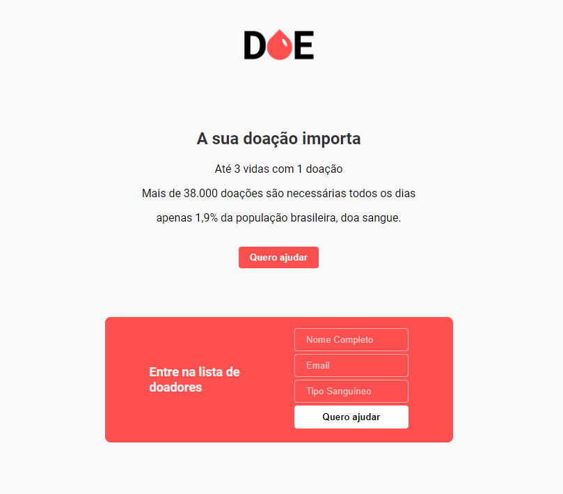
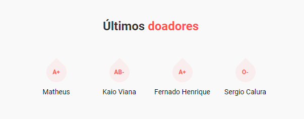

# DOE Sangue,

Este projeto foi desenvolvido durante a MaratonaDev_3 da RokectSet

Com a proposta de desenvolver uma aplicação web totalmente do zero utilizando técnologias em alta no mercado em apenas dois dias. 

### Arquitetura
Devido a aplicação ser extremamente simples, uma aplicação de apenas uma página, sua arquitetura é muito simples, com o **Frontend**
sendo construído usando basicamente `HTML` e `CSS` e o **Backend** construído em `Nodejs` com a integração do bando de dados `Postgres`.

### Design da Aplicação

A aplicação funciona de forma muito simples, clicando no botão **Quero ajudar** o formulário se abre e assim quando uma pessoa se cadastra, 
essa informação é enviada e armazenada no bando de dados e depois recuperada e exibida na seção de últimos doadores.

#### Lista de doadores

